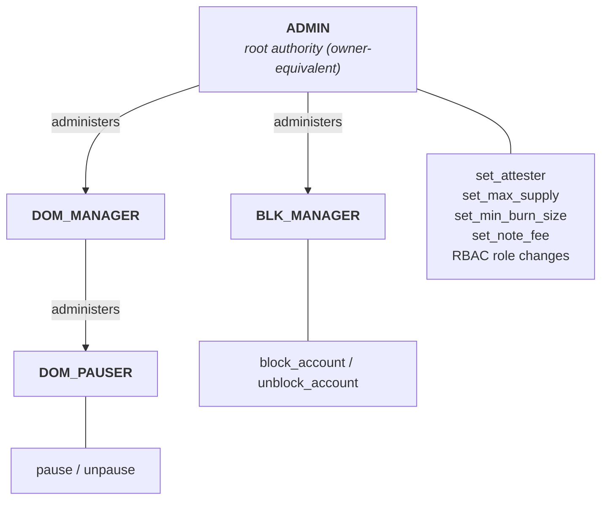

# USDCx on Miden: architecture and audit orientation

## 1. Scope and state

The audit targets the **`implementation` branch** of `0xMiden/miden-usdcx`. The audited surface is the on-chain USDCx faucet: the `crates/xusdc-encoding` crate, containing the Miden Assembly (under its `asm/` tree) together with the account builder, note factories, codecs, and their tests. The review PR that tracks this surface diffs exactly that crate. The two off-chain services (deposit relayer, withdrawal attester) are outside the audit scope; they appear here as external actors together with the assumptions the account leaves to them.

This document describes `implementation` **as it will stand once the currently open PRs merge** (the v16 protocol migration itself is already merged). Where a detail is still in flight it is flagged.

## 2. What the system does

USDCx is a Miden-native fungible asset representing USDC reserved in Circle's xReserve. The on-chain account is a public, keyless fungible faucet. A mint consumes an admitted mint note, authenticates a Circle-signed deposit intent, checks replay and policy state, increments supply, and creates a recipient-bound output note containing the native asset. A burn consumes an admitted burn note, destroys its USDCx asset, and decrements supply.

```text
external reserve decision
        |
signed deposit intent
        |
public mint note plus committed attachments     <- submitted by the deposit relayer
        |
USDCx faucet: reconstruct, verify, mint, mark nonce
        |
recipient-bound USDCx note
        |
public burn note                                <- created by the holder
        |
USDCx faucet: receive asset, apply policies, burn, debit supply
        |
external redemption decision                    <- signed by the withdrawal attester
```

The local safety argument has two halves:

1. Supply can increase only through the stock mint accounting which requires the mint policy with its attestation policy to pass successfully.
2. An accepted burn destroys the active USDCx asset and reduces `token_supply` by the same asset amount.

That is not, by itself, a proof of one-to-one external backing. Local conservation is conditional on a correct initial state: the constructor accepts the initial `token_supply` independently from any distribution of initial assets. Reserve custody, external release, destination support, and finality policy are outside this code.

## 3. Keyless authorization and the capability boundary

The faucet is a public network account with no signing key. Its outer external capability boundary is a fixed allowlist of note-script roots plus one transaction-script root (the stock expiration script); inner boundaries are RBAC, Authority, the active policy roots, transfer callbacks, mint cryptography, and internal authentication and fee dispatch. A root commits to complete code, but admitting one branching root admits every action that script implements. Permissionless submission does not imply permissionless code execution.

Standard configuration mutators (metadata setters, policy setters, freeze/unfreeze, allowlist mutators) are installed by the stock components but deliberately have no admitted entry path: they are unreachable only while the allowlists and internal dispatch remain unchanged. Reachability must be derived from the admitted roots, never inferred from installed code.

Two properties are load-bearing:

- **Atomicity.** An assertion failure rejects the transaction and rolls back all of its writes. The mint policy marks the deposit nonce before downstream stock operations complete and relies on this rollback.
- **Two replay layers.** A note's protocol nullifier prevents reuse of that note; the application-level deposit nonce is separate state, because one signed deposit could otherwise be carried by more than one independently constructed mint note.

## 4. The faucet: composition and state

The account is composed from the stock components (`FungibleFaucet`, `Pausable`, `MinBurnAmount`, `BasicBlocklist`, `TokenPolicyManager`, `PausableManager`, `BlocklistManager`, `RoleBasedAccessControl`, `Authority`, network-account authentication with its fee-policy companion, and a `ConstantFeeManager`) plus one local `xreserve` component contributing the attester-commitment map, the used-nonce map, and the domain configuration. The local MASM contributes two account procedures: the attester setter and the mint policy. RBAC seeding uses the protocol's stock `RoleBasedAccessControl` builder. The shipped MASM is assembled at build time from declared Miden projects (`miden-project.toml`) by the protocol's own build tooling, not at runtime.

State, grouped by writer posture:

- **Fixed by construction:** decimals, symbol, token metadata, destination domain, source domain and external-contract identifier words (seeded configuration, no runtime writer), active policy roots, both script allowlists, Authority mode, and the network sponsorship policy (chosen at deployment, no mutator).
- **Runtime-mutable through admitted authorized paths:** pause state, enabled attester commitments, `max_supply`, minimum burn amount, blocked accounts, the RBAC membership and role-admin graph, and the per-note-root fee schedule (`set_note_fee`, ADMIN-gated, keys required to match the admitted note roots).
- **Append-only on accepted mints:** the used-nonce map, keyed by a deterministic hash of the 32-byte deposit nonce.

Identity: construction produces a commitment-derived account identifier; the identifier is a function of the initialization seed and the composed code and storage commitments, not a separately supplied stable identifier. Account code cannot be changed in place afterwards; any code change is a replacement deployment with a new identifier.

The fee surface is live, not vestigial: the builder takes an explicit fee faucet identifier and constant fee policy, and ADMIN can change per-root fees at runtime. Fee misconfiguration interacts with network sponsorship (a config note priced at zero is unsponsored and must be paid by the account itself), so fee values and the sponsorship policy need to be reviewed together.

## 5. Mint path

Rust factories and codecs reject malformed inputs early and create the intended note shape. They improve reliability but are not the security boundary, because an arbitrary submitter can construct transport bytes independently. The binding decision is the MASM path (`crates/xusdc-encoding/asm/xreserve/`: `mint_policy.masm`, `deposit_intent.masm`, `attestation_verify.masm`):

1. Network-account authentication requires the mint note's script root to be admitted.
2. The mint policy requires exactly one mint transport attachment and one routing attachment, obtained through the protocol API that verifies attachment bytes against their commitment.
3. Pause state and the faucet-asset binding sit in the stock layer around the policy rather than in the policy itself: `policy_manager::execute_mint_policy` asserts the account is not paused and then dispatches the mint policy root recorded in storage, and stock `mint_and_send` asserts the note's asset is this faucet's own after the policy returns.
4. The asset amount must be nonzero and representable; the same amount is inserted into the reconstructed signed bytes and later supplied to stock mint accounting.
5. The compressed carried intent is admitted, its committed extent is bound before any tail read, and transport padding beyond the signed extent is rejected. The full signed message is reconstructed byte-exactly from constants, trusted account state, the active asset, and carried fields.
6. The policy hashes exactly the returned message length with Keccak-256, derives a Poseidon2 commitment from the presented secp256k1 key, requires that commitment to be enabled in the attester map, and verifies the signature over the reconstructed message under that same key using the core library's byte-oriented ECDSA verifier (`verify_bytes`).
7. It binds the output to a public recipient note, a tag derived deterministically from the recipient (`note_tag::create_account_target`), the derived recipient commitment, the exact amount, and a nonce-derived serial number, using the locally validated account-id representation.
8. It writes the nonce-used marker, then calls upstream cap and output operations; atomicity rolls the marker back if any later step fails.

Semantics worth stating plainly:

- The signed `maxFee` is a ceiling (`maxFee <= amount`), not an amount paid. No separate `feeAmount` or relayer payout exists; the complete amount goes to the recipient.
- `localToken`, `localDepositor`, and `hookData` change the signature digest but carry no local semantics. The binding MASM does not yet reject zero `localToken`/`localDepositor` (the off-chain relayer does, but preflight is not the on-chain gate; adding the on-chain checks is planned). These fields are treated as opaque 32-byte values, not EVM-typed addresses. `hookData` is never executed.
- The supported `hookData` ceiling is 3,840 bytes: the codec constant is computed at compile time as the note-attachment capacity less the fixed transport prefixes, and a compile-time assertion separately keeps the rebuilt preimage within the protocol's note-storage limit.

## 6. Burn and redemption path

The burn note factory builds a public note carrying the stock `BurnNote` script, one USDCx asset in the note's storage (the stock script requires storage to hold exactly the burned asset), a fixed use-case tag, and the Circle withdrawal payload (amount, destination domain, destination recipient, salt) as a **committed attachment**. Consumed against the faucet, the stock path receives the asset, runs the burn and transfer policies (minimum-burn floor, pause, blocklist callbacks), destroys the asset, and decrements `token_supply` by the asset amount.

The attachment design has a property reviewers must not miss: **the consume script never reads attachments, so the withdrawal payload is not verified on-chain.** It is tamper-evident, because the note identifier commits to the note's attachments, but nothing on-chain checks its content. Consequences:

- **Payload-amount binding is off-chain work.** The chain burns and debits exactly the note's asset amount; the payload's declared amount is unread. A hand-built note can declare a payload amount that differs from the asset it burns, omit the payload, or use a different tag. The withdrawal attester must therefore validate the payload against the actually burned asset before signing, and Circle's confirmation that payload-equals-asset is required before authorization is one of our open questions to them.
- **Attachment presence is not guaranteed.** The stock burn script does not require the withdrawal attachment, so a burn note without it, or with a malformed one, still burns on-chain. Discovery and verification must handle such notes rather than assume the attachment exists.
- **Lifecycle is not staged.** A note can be created and consumed in the same block; the test suite demonstrates that supply then decreases while the note, its commitment, and its nullifier are absent from the discoverable record. A public note is not automatically a durable event-log equivalent. External release needs authenticated inclusion or state paths, the actual burned asset and amount, and an explicit finality rule.

No audited MASM reads the encoded destination domain, recipient, or salt; those bytes are inputs to the external redemption decision.

The hardening direction for both properties is a dedicated on-chain burn policy, folded together with the minimum-burn policy, that requires and validates the withdrawal attachment, combined with removing the duplicated amount from the attachment so it cannot disagree with the carried asset in the first place. Until that lands, the withdrawal attester carries these checks alone.

## 7. Roles and hierarchy

Authorization is decided by the *sender* of an admitted administrative note, checked against the on-chain role map. Roles bind to account IDs, not public keys, so any role can be held by a multisig account with no faucet change.



| Role | Initial administrator | Direct admitted powers |
|---|---|---|
| `ADMIN` | `ADMIN` (self) | Attester commitment map, maximum supply, minimum burn, note fees, and every fallback Authority path |
| `DOM_PAUSER` | `DOM_MANAGER` | Pause and unpause |
| `DOM_MANAGER` | `ADMIN` | Grant and revoke `DOM_PAUSER` membership |
| `BLK_MANAGER` | `ADMIN` | Block and unblock transfer participants |

Only the pause pair and the blocklist pair are individually role-gated; everything else Authority-gated falls back to `ADMIN`. `ADMIN` reaches every role: it administers `DOM_MANAGER` and `BLK_MANAGER` directly and `DOM_PAUSER` in two hops by granting itself `DOM_MANAGER`. This mirrors the single all-powerful owner in Circle's reference token; the role split below `ADMIN` is operational hygiene, not a boundary against a compromised `ADMIN`. The mitigation for `ADMIN` compromise is custody (a multisig holding it), not code.

What the RBAC deliberately lacks, and reviewers should treat as designed-in risk: the stock RBAC root admits grant, revoke, change-role-admin, and self-renounce at runtime, with no two-step handover, no last-admin guard, no timelock, and no prohibition on cycles, overlapping memberships, or emptying a role (including `ADMIN` itself).

Administrative notes are target-bound: the local set-attester note enforces a consume gate against its `NetworkAccountTarget` attachment, and the stock configuration notes adopted with the v16-line protocol carry the same target binding. Reviewers should verify the binding uniformly across every admitted administrative root (including the local max-supply and min-burn notes) and check whether admin scripts reject attached assets; asset acceptance on an admin note is a vault-hardening gap, not an authorization bypass.

The transfer blocklist applies on both send and receive callbacks, and the v16-line policy exempts the issuing faucet from its own blocklist, so the faucet cannot be bricked by self-blocking.

## 8. The off-chain services (out of audit scope)

- **Deposit relayer** (`crates/xreserve-deposit-relayer`): watches Circle's source chain, packages attested deposit intents into mint notes, and submits them. Its submission authority is not trusted: the account independently enforces script admission and every binding mint check, so a hostile submitter can waste work but cannot bypass signature or policy checks. Absence halts mint liveness only.
- **Withdrawal attester** (`crates/withdrawal-listener-attester`): watches for faucet burns, establishes that a burn really happened, and signs the attestation Circle's source-chain contract verifies before releasing reserves. The account proves only the accepted Miden state transition; the attester must independently establish canonical burn verification, finality, payload-to-asset equality, and destination meaning before external release. Compromise threatens external redemption decisions; this is the fund-critical service.
- **Dependency assumptions:** the Miden network, VM, kernel, and standards provide proof verification, state authentication, ordering, nullifiers, and atomicity. A single node response is not an independent finality proof.
