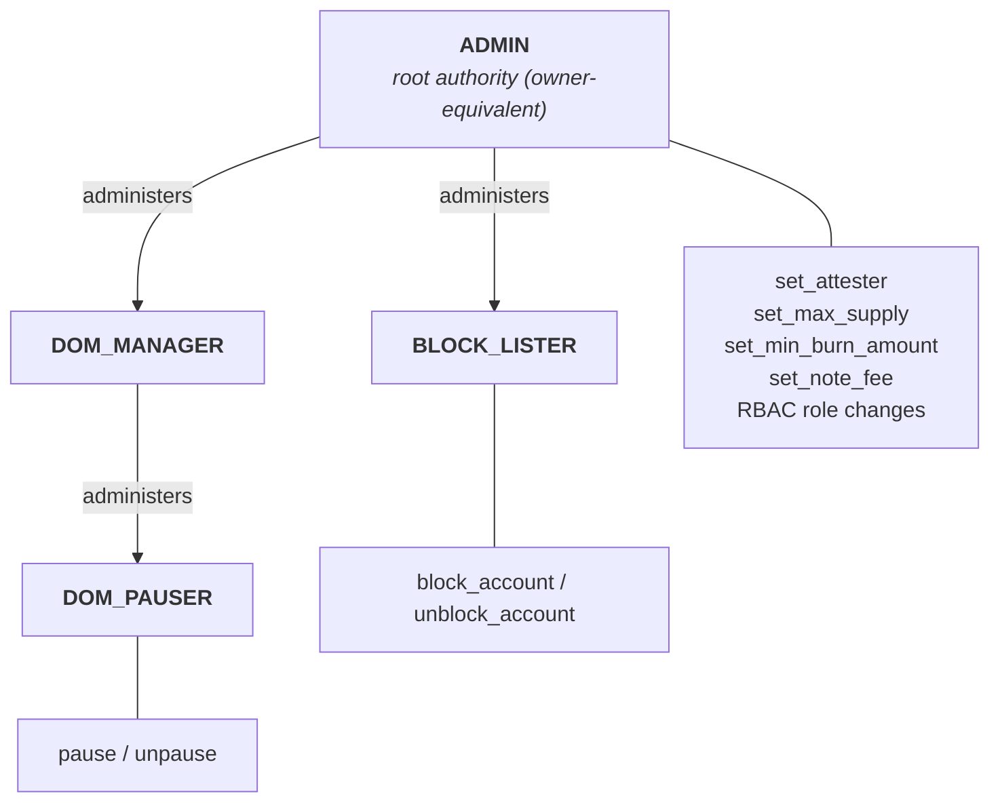

# USDCx on Miden: architecture and audit orientation

## 1. Scope and state

The audited surface is the on-chain USDCx faucet of `0xMiden/miden-usdcx`: the `crates/xusdc-encoding` crate, containing the Miden Assembly (under its `asm/` tree) together with the account builder, note factories, codecs, and their tests. The two off-chain services (deposit relayer, withdrawal attester) are outside the audit scope; they appear here as external actors together with the assumptions the account leaves to them. Where a detail is still in flight it is flagged.

## 2. What the system does

USDCx is a Miden-native fungible asset representing USDC reserved in Circle's xReserve. The on-chain account is a public, permissionless fungible faucet. A mint consumes an admitted `MINT` note, authenticates a Circle-signed deposit intent, checks replay and policy state, increments supply, and creates a recipient-bound output note containing the asset. A burn consumes an admitted `BURN` note, destroys its USDCx asset, and decrements supply.

```text
external reserve decision
        |
signed deposit intent
        |
public mint note plus committed attachments     <- submitted by the deposit relayer
        |
USDCx faucet: reconstruct, verify, mint, mark nonce
        |
recipient-bound USDCx note
        |
public burn note                                <- created by the holder
        |
USDCx faucet: receive asset, apply policies, burn, debit supply
        |
external redemption decision                    <- signed by the withdrawal attester
```

The local safety argument has two halves:

1. Supply can increase only through the standard mint accounting which requires the mint policy with its attestation policy to pass successfully.
2. An accepted burn destroys the active USDCx asset and reduces `token_supply` by the same asset amount.

That is not, by itself, a proof of one-to-one external backing. Local conservation is conditional on a correct initial state: the constructor accepts the initial `token_supply` independently from any distribution of initial assets. Reserve custody, external release, destination support, and finality policy are outside this code.

## 3. Permissionless submission and the capability boundary

The faucet is a public network account with no signing key. Its outer external capability boundary is a fixed allowlist of note-script roots plus one transaction-script root (the `miden-standards` expiration script); inner boundaries are RBAC, Authority, the active policy roots, transfer callbacks, mint cryptography, and internal authentication and fee dispatch. A root commits to complete code, but admitting one branching root admits every action that script implements. Permissionless submission does not imply permissionless code execution.

Standard configuration mutators (metadata setters, policy setters, freeze/unfreeze, allowlist mutators) are installed by the `miden-standards` components but deliberately have no admitted entry path because their roots are absent from the note allowlist.

Two properties are load-bearing:

- **Atomicity.** An assertion failure rejects the transaction and rolls back all of its writes.
- **Two replay layers.** A note's nullifier prevents reuse of that note; the application-level deposit nonce is separate state, because one signed deposit could otherwise be carried by more than one independently constructed mint note.

## 4. The faucet: composition and state

The account is composed from the `miden-standards` components (`FungibleFaucet`, `Pausable`, `MinBurnAmount`, `BasicBlocklist`, `TokenPolicyManager`, `PausableManager`, `BlocklistManager`, `RoleBasedAccessControl`, `Authority`, network-account authentication with its fee-policy companion, and a `ConstantFeeManager`) plus one local `xreserve` component contributing the attester-commitment map, the used-nonce map, and the domain configuration. A separate zero-slot component supplies the burn policy.

State, grouped by writer posture:

- **Fixed by construction:** decimals, symbol, token metadata, destination domain, active policy roots, note & tx script allowlists, Authority mode, and the network sponsorship policy.
- **Runtime-mutable through admitted authorized paths:** pause state, enabled attester commitments, `max_supply`, minimum burn amount, blocked accounts, the RBAC membership and role-admin graph, and the per-note-root fee schedule.
- **Append-only on accepted mints:** the used-nonce map, keyed by a deterministic hash of the 32-byte deposit nonce.

Identity: construction produces a commitment-derived account identifier; the identifier is a function of the initialization seed and the composed code and storage commitments.

## 5. Mint path

Rust factories and codecs reject malformed inputs early and create the intended note shape. They improve reliability but are not the security boundary, because an arbitrary submitter can construct transport bytes independently. The binding decision is the MASM path (`crates/xusdc-encoding/asm/xreserve/`: `mint_policy.masm`, `deposit_intent.masm`, `attestation_verify.masm`):

1. Network-account authentication requires the mint note's script root to be admitted.
2. The mint policy requires exactly one mint transport attachment and one routing attachment, obtained through the protocol API that verifies attachment bytes against their commitment.
3. Pause state and the faucet-asset binding sit in the `miden-standards` layer around the policy rather than in the policy itself: `policy_manager::execute_mint_policy` asserts the account is not paused and then dispatches the mint policy root recorded in storage, and the `miden-standards` `mint_and_send` asserts the note's asset is this faucet's own after the policy returns.
4. The asset amount must be nonzero and representable; it is inserted into the reconstructed signed bytes and used for standard supply accounting.
5. The note only carries a compressed intent, and the full signed intent (= message) is reconstructed from constants, onchain faucet account state, the active asset, and the compressed intent.
6. The policy hashes the deposit intent (= message) with Keccak-256, derives a Poseidon2 commitment from the presented secp256k1 key, requires that commitment to be enabled in the attester map, and verifies the signature over the reconstructed message.
7. It binds the output to a public recipient note, a tag derived deterministically from the recipient (`note_tag::create_account_target`), the derived recipient commitment, the exact amount, and a nonce-derived serial number, using the locally validated account-id representation.
8. It writes the nonce-used marker, then calls upstream cap and output operations.

Semantics worth stating plainly:

- The signed `maxFee` is a ceiling (`maxFee <= amount`), not an amount paid. No separate `feeAmount` or relayer payout exists _today_; the complete amount goes to the recipient.
- `localToken`, `localDepositor`, and `hookData` change the signature digest but carry no local semantics. The binding MASM does not yet reject zero `localToken`/`localDepositor` (the off-chain relayer does, but preflight is not the on-chain gate; adding the on-chain checks is planned). These fields are treated as opaque 32-byte values, not EVM-typed addresses. `hookData` is never executed.
- The supported `hookData` ceiling is 3,840 bytes: the codec constant is computed at compile time as the note-attachment capacity less the fixed transport prefixes, and a compile-time assertion separately keeps the rebuilt preimage within the Miden protocol's note-storage limit.

## 6. Burn and redemption path

The burn note factory builds a public note carrying the `miden-standards` `BurnNote` script, one USDCx asset in the note's storage (the script requires storage to hold exactly the burned asset), a fixed use-case tag, and the Circle withdrawal payload (destination domain, destination recipient) as a **committed attachment**. Consumed against the faucet, the `miden-standards` path receives the asset, runs the burn and transfer policies (minimum-burn floor, pause, blocklist callbacks), destroys the asset, and decrements `token_supply` by the asset amount.

**Lifecycle is not staged.** A note can be created and consumed in the same block; the test suite demonstrates that supply then decreases while the note, its commitment, and its nullifier are absent from the discoverable record. A public note is not automatically a durable event-log equivalent. External release needs authenticated inclusion or state paths, the actual burned asset and amount, and an explicit finality rule.

The burn policy decodes no destination domain or recipient; these fields are validated off chain.

The burn policy requires exactly two attachments: a scheme-2 routing target and a scheme-6 withdrawal attachment of three words, with content verified against the note commitment.

## 7. Roles and hierarchy

Authorization is decided by the *sender* of an admitted administrative note, checked against the on-chain role map. Roles bind to account IDs, not public keys, so any role can be held by a multisig account with no faucet change.



| Role | Initial administrator | Direct admitted powers |
|---|---|---|
| `ADMIN` | `ADMIN` (self) | Attester commitment map, maximum supply, minimum burn, note fees, and every fallback Authority path |
| `DOM_PAUSER` | `DOM_MANAGER` | Pause and unpause |
| `DOM_MANAGER` | `ADMIN` | Grant and revoke `DOM_PAUSER` membership |
| `BLOCK_LISTER` | `ADMIN` | Block and unblock transfer participants |

Only the pause pair and the blocklist pair are individually role-gated; everything else Authority-gated falls back to `ADMIN`. `ADMIN` reaches every role: it administers `DOM_MANAGER` and `BLOCK_LISTER` directly and `DOM_PAUSER` in two hops by granting itself `DOM_MANAGER`. This mirrors the single all-powerful owner in Circle's reference token; the role split below `ADMIN` is operational hygiene, not a boundary against a compromised `ADMIN`. The mitigation for `ADMIN` compromise is custody (a multisig holding it), not code.

What the RBAC deliberately lacks, and reviewers should treat as designed-in risk: the `miden-standards` RBAC root admits grant, revoke, change-role-admin, and self-renounce at runtime, with no two-step handover, no last-admin guard, no timelock, and no prohibition on cycles, overlapping memberships, or emptying a role (including `ADMIN` itself).

Administrative notes are target-bound: the local set-attester note enforces a consume gate against its `NetworkAccountTarget` attachment, and all the `miden-standards` configuration notes carry the same target binding.

The transfer blocklist applies on both send and receive callbacks.

## 8. The off-chain services (out of audit scope)

- **Deposit relayer** (`crates/xreserve-deposit-relayer`): watches Circle's source chain, packages attested deposit intents into mint notes, and submits them. Its submission authority is not trusted: the account independently enforces script admission and every binding mint check, so a hostile submitter can waste work but cannot bypass signature or policy checks. Absence halts mint liveness only.
- **Withdrawal attester** (`crates/withdrawal-listener-attester`): watches for faucet burns, establishes that a burn really happened, and signs the attestation Circle's source-chain contract verifies before releasing reserves. The account proves only the accepted Miden state transition; the attester must independently establish canonical burn verification, finality, payload-to-asset equality, and destination meaning before external release. Compromise threatens external redemption decisions; this is the fund-critical service.
- **Dependency assumptions:** the Miden network, VM, kernel, and standards provide proof verification, state authentication, ordering, nullifiers, and atomicity. A single node response is not an independent finality proof.
