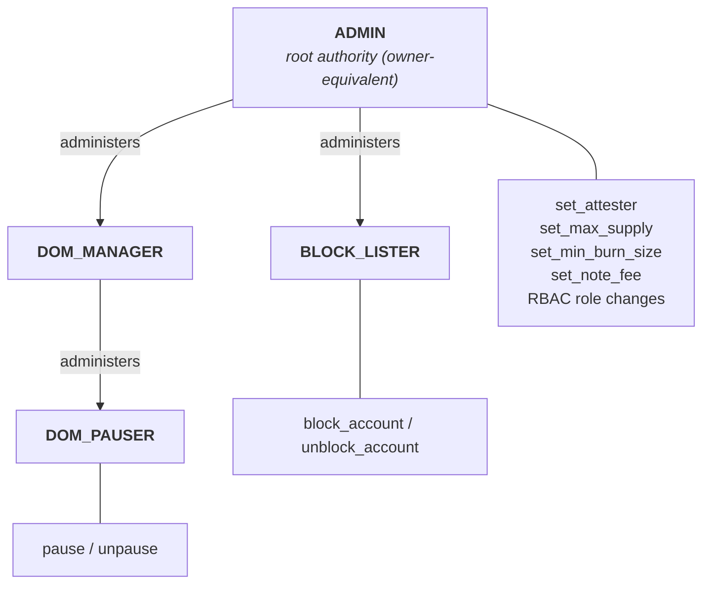

# USDCx on Miden: intentional deviations and known open items

This briefing complements `docs/ARCHITECTURE.md` in the repository. That document explains how the system works; this one explains where the implementation deliberately deviates from Circle's xReserve specification (the published material plus Circle's partner integration guidelines), which gaps we already know about, and how the governance model is expected to change.

Everything here concerns the audited surface, the `crates/xusdc-encoding` crate on the `implementation` branch. Deviations that live purely in the off-chain services are being resolved with Circle directly and are not listed; the services appear in `docs/ARCHITECTURE.md` only as untrusted external actors.

## 1. Governance and the role hierarchy

The faucet is keyless: every administrative action arrives as an allowlisted note, and authorization is decided by which account sent it, checked against the on-chain role map. Roles bind to account IDs, not public keys, so any role can be held by a multisig account with no faucet change. Documentation uses the name BLOCK_LISTER for the blocklist-administration role; the in-code symbol still carries an earlier working name, and the rename is planned.

| Operation | Required role |
|---|---|
| pause / unpause | DOM_PAUSER |
| block_account / unblock_account | BLOCK_LISTER |
| everything else (attester allowlist, supply cap, burn floor, note fees, role administration) | ADMIN |

Only the pause pair and the blocklist pair carry a dedicated role; every other authority-gated procedure is unassigned and falls back to ADMIN ([role map](https://github.com/0xMiden/miden-usdcx/blob/f1a0a4cee961e7d8ad1073ad99f01aedd4c03987/crates/xusdc-encoding/src/account/xreserve/admin_authority.rs#L57-L79)). Properties to treat as designed rather than discovered:

- **ADMIN reaches every role.** It administers DOM_MANAGER and BLOCK_LISTER directly and DOM_PAUSER in two hops by granting itself DOM_MANAGER. This mirrors the single all-powerful owner in Circle's reference token; the role split below ADMIN is operational hygiene, not a boundary against a compromised ADMIN. The mitigation is custody, not code.
- **Handover is grant-then-revoke.** There is no two-step ownership transfer; during a handover both the old and new account hold ADMIN. The stock RBAC ([rbac.masm](https://github.com/0xMiden/protocol/blob/v0.16.0-rc.4/crates/miden-standards/asm/standards/access/rbac.masm#L158-L291)) also permits self-renounce, role-admin changes, overlapping memberships, and emptying a role (including ADMIN), with no last-admin guard and no timelock. Recommendations here are welcome, but the absence of these rails is a known, accepted state for the audited revision.
- **One pause flag, one role, one authorization.** Pause and unpause share the DOM_PAUSER role and one admitted root, the single flag halts both mint and burn, and an unpause executes after one authorized note with no second on-chain approval ([manager](https://github.com/0xMiden/protocol/blob/v0.16.0-rc.4/crates/miden-standards/asm/standards/access/pausable/manager.masm#L20-L54)). Circle's partner integration guidelines contemplate joint approval for an unpause; if that requirement applies to this local switch, it will most likely be realized in role custody (a multisig holding DOM_PAUSER).
- **The admin surface stays mostly live under pause.** The administrative paths are not pause-gated, with one exception: the stock max-supply setter inherits the standard faucet's not-paused assertion, so the supply cap cannot be changed while paused. The consequence that matters: a compromised attester key can be disabled while the faucet is paused ([attester_admin.masm](https://github.com/0xMiden/miden-usdcx/blob/f1a0a4cee961e7d8ad1073ad99f01aedd4c03987/crates/xusdc-encoding/asm/xreserve/attester_admin.masm#L1-L67)).
- **BLOCK_LISTER separation is proven only at deployment.** The builder rejects a BLOCK_LISTER holder that collides with ADMIN, DOM_PAUSER, or DOM_MANAGER ([collision checks](https://github.com/0xMiden/miden-usdcx/blob/f1a0a4cee961e7d8ad1073ad99f01aedd4c03987/crates/xusdc-encoding/src/account/xreserve/builder/mod.rs#L248-L268)), other seed collisions are not builder-checked (tracked among the audit-finding issues), and the membership graph is runtime-mutable, so even the checked separation can be collapsed later by authorized role changes.

**The hierarchy may still change.** From our governance review, and pending partner sign-off, we are considering removing DOM_MANAGER entirely (on the token side its only function is administering DOM_PAUSER) and splitting the broad ADMIN into dedicated per-function admin roles, for example a deposit-attester admin that alone holds `set_attester`. Custody-wise, the direction is multisig accounts holding the critical roles, with key holders drawn from a security council (co-founders, investors, and directly affected parties). None of this is implemented; audit the current model, but weigh recommendations knowing this restructuring is on the table.

## 2. Intentional deviations from Circle's specification

Circle's specification is written for EVM deployments. The following differences are deliberate; the useful audit work is verifying that each stated property actually holds.

**The capability boundary is ten note roots plus one transaction script.** The allowlist admits mint, burn, the two local setter notes (attester, burn floor), the stock faucet-metadata config note (which carries the supply-cap setter and, behind the same root, three runtime-inert metadata setters), the stock pause, blocklist, and role config notes, and the fee-config and fee-sponsorship notes; the only admitted transaction script is the expiration script, and the network-account config note is excluded, so neither allowlist can be changed through an accepted note: the boundary is immutable in effect for a deployed faucet ([note allowlist](https://github.com/0xMiden/miden-usdcx/blob/f1a0a4cee961e7d8ad1073ad99f01aedd4c03987/crates/xusdc-encoding/src/account/xreserve/builder/network_auth.rs#L27-L51), [auth component](https://github.com/0xMiden/miden-usdcx/blob/f1a0a4cee961e7d8ad1073ad99f01aedd4c03987/crates/xusdc-encoding/src/account/xreserve/builder/network_auth.rs#L89-L104)).

**Attester identity is a key commitment, not a recovered address.** Circle's reference recovers an EVM address from the signature; the faucet instead verifies against a presented secp256k1 key and allowlists Poseidon2 commitments of the key limbs. The map supports any number of concurrently enabled attesters, so rotation is add-before-disable with overlap; the setter writes the caller's commitment verbatim without recomputing it from a key, and a disabled entry is indistinguishable from an absent one ([allowlist gate](https://github.com/0xMiden/miden-usdcx/blob/f1a0a4cee961e7d8ad1073ad99f01aedd4c03987/crates/xusdc-encoding/asm/xreserve/attestation_verify.masm#L67-L92)). The property worth verifying: the same pubkey pointer feeds both the commitment lookup and the signature check, so an allowlisted commitment cannot be paired with a foreign key.

**Digest and staging.** The verified digest is raw Keccak-256 over the byte-exact rebuilt DepositIntent, no EIP-191/712 wrapping. The signature's recovery byte is not part of the on-chain witness. The rebuild zeroes the whole fixed header before writing fields and the policy runs in a fresh `dyncall` context ([zeroing](https://github.com/0xMiden/miden-usdcx/blob/f1a0a4cee961e7d8ad1073ad99f01aedd4c03987/crates/xusdc-encoding/asm/xreserve/deposit_intent.masm#L152-L166), [context note](https://github.com/0xMiden/miden-usdcx/blob/f1a0a4cee961e7d8ad1073ad99f01aedd4c03987/crates/xusdc-encoding/asm/xreserve/mint_policy.masm#L45-L58)). The verifier takes the key and scalars from the advice provider; the staging binds each region to a Poseidon2 commitment of its own contents via `adv.insert_mem` ([staging](https://github.com/0xMiden/miden-usdcx/blob/f1a0a4cee961e7d8ad1073ad99f01aedd4c03987/crates/xusdc-encoding/asm/xreserve/attestation_verify.masm#L112-L175)). That substitution-proofness argument is load-bearing and is exactly the kind of claim we want checked.

**Amount range and supply ceiling.** Circle signs amounts as uint256; the codec narrows them to Miden's asset-amount range at the boundary (at the deployed scale the reduction is the identity; every path out is an exact value or an error, nothing saturates or truncates), and the faucet additionally enforces a runtime-mutable `max_supply`, an ADMIN power Circle's token surface does not have at all ([codec](https://github.com/0xMiden/miden-usdcx/blob/f1a0a4cee961e7d8ad1073ad99f01aedd4c03987/crates/xusdc-encoding/src/xreserve/encoding/amount.rs#L31-L41), [policy checks](https://github.com/0xMiden/miden-usdcx/blob/f1a0a4cee961e7d8ad1073ad99f01aedd4c03987/crates/xusdc-encoding/asm/xreserve/mint_policy.masm#L219-L245), [mutable cap](https://github.com/0xMiden/miden-usdcx/blob/f1a0a4cee961e7d8ad1073ad99f01aedd4c03987/crates/xusdc-encoding/src/account/xreserve/builder/construction.rs#L252-L266)). The property to attack: a validly signed intent above either bound must fail closed without minting and without consuming the deposit nonce.

**Compile-time wire constants** The DepositIntent magic and version are compiled in and stamped into the reconstructed preimage, never read from the incoming message, so a Circle-side change fails signature verification rather than being accepted ([stamp](https://github.com/0xMiden/miden-usdcx/blob/f1a0a4cee961e7d8ad1073ad99f01aedd4c03987/crates/xusdc-encoding/asm/xreserve/deposit_intent.masm#L158-L166)).

**Fail-closed recipient validation.** Circle treats `remoteRecipient` as opaque bytes32; the faucet additionally requires the bytes to decode to a structurally valid Miden account ID before minting, because the output note must be spendable. On failure nothing is minted, the nonce stays unconsumed, and the deposit remains recoverable externally ([validation](https://github.com/0xMiden/miden-usdcx/blob/f1a0a4cee961e7d8ad1073ad99f01aedd4c03987/crates/xusdc-encoding/asm/xreserve/deposit_intent.masm#L195-L207)). The replay guard is assert-only on the reject path and marks the nonce only on accept ([nonce path](https://github.com/0xMiden/miden-usdcx/blob/f1a0a4cee961e7d8ad1073ad99f01aedd4c03987/crates/xusdc-encoding/asm/xreserve/mint_intent.masm#L82-L146)).

**The blocklist checks the executing account and exempts the issuer.** The stock policy, installed on both send and receive, checks the transaction's native account against the list and exempts the issuing faucet itself ([policy](https://github.com/0xMiden/protocol/blob/v0.16.0-rc.4/crates/miden-standards/asm/standards/faucets/policies/transfer/basic_blocklist.masm#L36-L65), [installation](https://github.com/0xMiden/miden-usdcx/blob/f1a0a4cee961e7d8ad1073ad99f01aedd4c03987/crates/xusdc-encoding/src/account/xreserve/builder/construction.rs#L174-L190)). Three consequences are deliberate: a blocklist entry for the faucet itself is inert; minting to a blocked recipient succeeds, and the output note is then stranded until the recipient is unblocked; and blocking freezes, it never seizes, there is no clawback. Circle's token specification has no blocklist at all, so this whole surface is a flagged addition.

**Network fees are not Circle's fee model.** The signed `maxFee` is only a ceiling check on the mint path; Circle's separate `feeAmount` allocation does not exist and the full amount goes to the recipient (see `docs/ARCHITECTURE.md`). Independently, the faucet carries a Miden network-fee surface: a deployment-time constant-fee schedule keyed by exactly the admitted note roots (the builder rejects any other shape), an ADMIN-gated `set_note_fee`, and a fee-sponsorship note ([fee wiring](https://github.com/0xMiden/miden-usdcx/blob/f1a0a4cee961e7d8ad1073ad99f01aedd4c03987/crates/xusdc-encoding/src/account/xreserve/builder/network_auth.rs#L54-L83)). The concrete fee values are provisional deployment policy, not Circle requirements; the mechanism is the audit target, not the numbers.

**Seeded-but-unread configuration.** The builder seeds the source domain and the xReserve source-contract identifier into account storage at deployment ([seeding](https://github.com/0xMiden/miden-usdcx/blob/f1a0a4cee961e7d8ad1073ad99f01aedd4c03987/crates/xusdc-encoding/src/account/xreserve/builder/mod.rs#L270-L278)); runtime code reads only the destination-domain slot. This will look like dead state; it is intentional deployment configuration. Similarly small and deliberate: the on-chain symbol is `USDCX` because the protocol's symbol type accepts uppercase only, while the token name and Circle's display spelling are USDCx ([identity](https://github.com/0xMiden/miden-usdcx/blob/f1a0a4cee961e7d8ad1073ad99f01aedd4c03987/crates/xusdc-encoding/src/account/xreserve/builder/mod.rs#L96-L107)).

## 3. Known open items on the audited surface

**Zero `localToken` / `localDepositor` accepted on-chain.** Circle's spec requires the mint contract itself to reject a zero value in either field. Our off-chain relayer rejects them during parsing, but the binding MASM copies both verbatim into the signed preimage without a zero check, so a validly signed zeroed intent would mint ([verbatim copy](https://github.com/0xMiden/miden-usdcx/blob/f1a0a4cee961e7d8ad1073ad99f01aedd4c03987/crates/xusdc-encoding/asm/xreserve/deposit_intent.masm#L210-L224)).

**Burn payload attachment: unread and optional.** The burn note's withdrawal payload rides as a committed attachment that the on-chain burn script never reads and does not require, so its declared amount can disagree with the asset actually burned, and a burn note without the attachment still burns ([note factory contract](https://github.com/0xMiden/miden-usdcx/blob/f1a0a4cee961e7d8ad1073ad99f01aedd4c03987/crates/xusdc-encoding/src/note/xreserve_burn.rs#L1-L20)). `docs/ARCHITECTURE.md` section 6 states the consequences; the planned fix (a burn policy requiring the attachment, with the duplicated amount removed from it) is tracked in issue #146. This is the leading fund-adjacent open item; adversarial work here is welcome and expected.

**Committed transport bytes outside the signed extent are unchecked.** The Keccak extent covers the fixed header plus `hookDataLen` bytes, and the attachment's word count is bound to that length ([binding](https://github.com/0xMiden/miden-usdcx/blob/f1a0a4cee961e7d8ad1073ad99f01aedd4c03987/crates/xusdc-encoding/asm/xreserve/deposit_intent.masm#L136-L150)), but the three fixed padding felts after the signature, the signature's recovery-byte felt (committed yet never read on-chain), and the limb bytes past the hookData extent inside the final words are committed by the note ID without being constrained ([layout](https://github.com/0xMiden/miden-usdcx/blob/f1a0a4cee961e7d8ad1073ad99f01aedd4c03987/crates/xusdc-encoding/asm/xreserve/mint_policy.masm#L26-L43)). One signed intent can therefore be carried by mint notes with distinct commitments; the deposit-nonce registry still limits it to one successful mint. The final-word limbs are tracked in issue #110; the padding and recovery-byte felts fall in the same class. Related tracked cleanup: packing the signature in the verifier's limb order at attachment creation, issue #138.

**Known findings live in the repository.** Open findings from an earlier internal review round are filed as issues labeled `audit-finding`; we do not repeat them here.

## 4. Where the rest lives

The mint-path binding sequence, burn semantics and lifecycle caveats, the state model, replay layering, hookData capacity, the role-note authorization mechanics, and the trust assumptions delegated to the off-chain services are all in `docs/ARCHITECTURE.md`. The repository also carries assets you can lean on rather than rebuild: golden vectors pinning the codec behavior, dual Rust/MASM parity tests over the DepositIntent reconstruction, and tripwire tests pinning constants and the callable surface. Deviations that concern only the off-chain services or the Circle API contract are being resolved with Circle directly and are out of audit scope.
