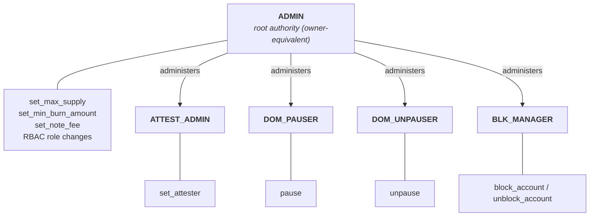

# USDCx on Miden: intentional deviations and known open items

This briefing complements `docs/ARCHITECTURE.md`. That document explains how the system works. This one lists where we deliberately deviate from Circle's xReserve specification (the published material plus Circle's partner integration guidelines), which gaps we already know about, and how the governance model is expected to change.

Everything here is about the audited surface: the `crates/xusdc-encoding` crate on the `implementation` branch. Deviations that only affect the off-chain services are not listed; we are resolving those with Circle directly. The services appear in `docs/ARCHITECTURE.md` as untrusted external actors.

## 1. Governance and the role hierarchy

The faucet has no signing key. Every administrative action arrives as an allowlisted note, and the faucet checks which account sent that note against its on-chain role map. Roles bind to account IDs, not public keys, so any role can be held by a multisig account without changing the faucet.

| Operation | Required role |
|---|---|
| pause | DOM_PAUSER |
| unpause | DOM_UNPAUSER |
| set_attester | ATTEST_ADMIN |
| block_account / unblock_account | BLK_MANAGER |
| everything else (supply cap, burn floor, note fees, role administration) | ADMIN |

Pause, unpause, set_attester and block/unblock have dedicated roles; every other gated procedure falls back to ADMIN ([role map](https://github.com/0xMiden/miden-usdcx/blob/f1a0a4cee961e7d8ad1073ad99f01aedd4c03987/crates/xusdc-encoding/src/account/xreserve/admin_authority.rs#L57-L79)). The following properties are designed, not accidental:

- **ADMIN can reach every role.** It administers ATTEST_ADMIN, DOM_PAUSER, DOM_UNPAUSER and BLK_MANAGER directly; as with Circle's all-powerful owner, custody is the defense against a compromised ADMIN.
- **Handover is grant-then-revoke.** There is no two-step ownership transfer. During a handover, the old and the new account both hold ADMIN for a moment. The stock RBAC ([rbac.masm](https://github.com/0xMiden/protocol/blob/v0.16.0-rc.4/crates/miden-standards/asm/standards/access/rbac.masm#L158-L291)) also allows self-renounce, role-admin changes, overlapping memberships, and emptying any role, including ADMIN. There is no last-admin guard and no timelock. We know this and accept it for the audited revision; recommendations are still welcome.
- **One pause flag, separate roles.** DOM_PAUSER pauses mint and burn, while DOM_UNPAUSER lifts the same flag through the same admitted note root ([manager](https://github.com/0xMiden/protocol/blob/v0.16.0-rc.4/crates/miden-standards/asm/standards/access/pausable/manager.masm#L20-L54)); the unpauser's quorum is a deployment custody decision (#197).
- **Admin actions still work while paused, with one exception.** Pause does not gate the administrative paths, so a compromised attester key can be disabled while the faucet is paused ([attester_admin.masm](https://github.com/0xMiden/miden-usdcx/blob/f1a0a4cee961e7d8ad1073ad99f01aedd4c03987/crates/xusdc-encoding/asm/xreserve/attester_admin.masm#L1-L67)). The exception is the supply cap: the stock max-supply setter asserts the faucet is not paused, so the cap cannot be changed during a pause.
- **Pause and blocklist holders are isolated at deployment.** The builder requires DOM_PAUSER and BLK_MANAGER each to hold no other role ([collision checks](https://github.com/0xMiden/miden-usdcx/blob/f1a0a4cee961e7d8ad1073ad99f01aedd4c03987/crates/xusdc-encoding/src/account/xreserve/builder/mod.rs#L248-L268)); ADMIN, ATTEST_ADMIN and DOM_UNPAUSER may overlap, and authorized runtime role changes can undo the initial separation.

## 2. Intentional deviations from Circle's specification

Circle wrote the specification for EVM deployments. The differences below are deliberate. The useful audit work is checking that each stated property actually holds, not reporting the difference itself.

**The capability boundary is an `ADMIN`-mutable allowlist.** As built, the note allowlist admits: mint, burn, the two local setter notes (attester and burn floor), the `miden-standards` faucet-metadata config note, the `miden-standards` pause, blocklist, and role config notes, the two fee notes (fee config and fee sponsorship), and the `miden-standards` network-account configuration note, through which `ADMIN` adds or removes note-script, transaction-script and fee-policy roots; a change applies from the next transaction, and a newly admitted note root also needs a fee schedule entry. The faucet-metadata root also exposes three metadata setters behind the same root; they are runtime-inert. As built, the only admitted transaction script is the expiration script ([note allowlist](https://github.com/0xMiden/miden-usdcx/blob/a9e6b001156814f4eb0bc43b2e2e9d9e162a0459/crates/xusdc-encoding/src/account/xreserve/builder/network_auth.rs#L26-L57), [auth component](https://github.com/0xMiden/miden-usdcx/blob/a9e6b001156814f4eb0bc43b2e2e9d9e162a0459/crates/xusdc-encoding/src/account/xreserve/builder/network_auth.rs#L59-L78)).

**Attester identity is a key commitment, not a recovered address.** Circle's reference recovers an EVM address from the signature. Our faucet works differently: the mint presents a secp256k1 key, and the faucet checks a Poseidon2 commitment of that key against its allowlist map. Three details matter. The map can hold any number of enabled attesters at once, so rotation is add-before-disable, with overlap. The setter stores whatever commitment the caller supplies; it does not recompute it from a key. And a disabled entry looks exactly like an absent one ([allowlist gate](https://github.com/0xMiden/miden-usdcx/blob/f1a0a4cee961e7d8ad1073ad99f01aedd4c03987/crates/xusdc-encoding/asm/xreserve/attestation_verify.masm#L67-L92)). The property to verify: the same pubkey pointer feeds both the commitment lookup and the signature check, so an allowlisted commitment cannot end up paired with a different key.

**Signature verification.** The faucet verifies ECDSA signatures over the rebuilt DepositIntent's Keccak-256 digest, without EIP-191 or EIP-712 wrapping, and ignores the signature's recovery byte. The verifier checks the public key against its commitment, but does not check a commitment to the signature itself. Reading the signature carried by the note therefore depends on the current advice-stack ordering ([verification code](https://github.com/0xMiden/miden-usdcx/blob/f1a0a4cee961e7d8ad1073ad99f01aedd4c03987/crates/xusdc-encoding/asm/xreserve/attestation_verify.masm#L112-L175)).

**Amount range and supply ceiling.** Circle signs amounts as uint256. Our codec narrows them to Miden's asset-amount range at the boundary; at the deployed scale this reduction is the identity, and every path either returns an exact value or an error. Nothing saturates or truncates ([codec](https://github.com/0xMiden/miden-usdcx/blob/f1a0a4cee961e7d8ad1073ad99f01aedd4c03987/crates/xusdc-encoding/src/xreserve/encoding/amount.rs#L31-L41), [policy checks](https://github.com/0xMiden/miden-usdcx/blob/f1a0a4cee961e7d8ad1073ad99f01aedd4c03987/crates/xusdc-encoding/asm/xreserve/mint_policy.masm#L219-L245)). On top of that, the faucet enforces a runtime-mutable `max_supply`, an ADMIN power that Circle's token surface does not have ([mutable cap](https://github.com/0xMiden/miden-usdcx/blob/f1a0a4cee961e7d8ad1073ad99f01aedd4c03987/crates/xusdc-encoding/src/account/xreserve/builder/construction.rs#L252-L266)). The property to attack: a validly signed intent above either bound must fail without minting and without consuming the deposit nonce.

**Compile-time wire constants.** The DepositIntent magic and version are compiled into the faucet and stamped into the rebuilt preimage. They are never read from the incoming message. If Circle ever changes either value, signatures simply stop verifying; nothing wrong gets accepted ([stamp](https://github.com/0xMiden/miden-usdcx/blob/f1a0a4cee961e7d8ad1073ad99f01aedd4c03987/crates/xusdc-encoding/asm/xreserve/deposit_intent.masm#L158-L166)).

**Fail-closed recipient validation.** Circle treats `remoteRecipient` as opaque bytes32. Our faucet additionally requires those bytes to decode to a valid Miden account ID of a supported version, because the output note must be spendable. If validation fails, nothing is minted, the deposit nonce stays unconsumed, and the deposit can be recovered externally ([validation](https://github.com/0xMiden/miden-usdcx/blob/f1a0a4cee961e7d8ad1073ad99f01aedd4c03987/crates/xusdc-encoding/asm/xreserve/deposit_intent.masm#L195-L207)). The replay guard follows the same pattern: it only asserts on the reject path, and it marks the nonce used only on accept ([nonce path](https://github.com/0xMiden/miden-usdcx/blob/f1a0a4cee961e7d8ad1073ad99f01aedd4c03987/crates/xusdc-encoding/asm/xreserve/mint_intent.masm#L82-L146)).

**The blocklist checks the executing account and exempts the issuer.** The stock policy runs on both send and receive. It checks the transaction's native account against the list, and it exempts the issuing faucet itself ([policy](https://github.com/0xMiden/protocol/blob/v0.16.0-rc.4/crates/miden-standards/asm/standards/faucets/policies/transfer/basic_blocklist.masm#L36-L65), [installation](https://github.com/0xMiden/miden-usdcx/blob/f1a0a4cee961e7d8ad1073ad99f01aedd4c03987/crates/xusdc-encoding/src/account/xreserve/builder/construction.rs#L174-L190)). Three consequences are deliberate. A blocklist entry for the faucet itself does nothing. Minting to a blocked recipient still succeeds, and the output note is then stranded until the recipient is unblocked. And blocking only freezes; there is no clawback. Circle's token specification has no blocklist at all, so this whole surface is an addition we have flagged to them.

**Network fees are not Circle's fee model.** On the mint path, the signed `maxFee` is only a ceiling check. Circle's separate `feeAmount` allocation does not exist here; the recipient receives the full amount (see `docs/ARCHITECTURE.md`). Separately, the faucet carries Miden's network-fee machinery: a constant fee schedule fixed at deployment and keyed by exactly the admitted note roots (the builder rejects any other shape), an ADMIN-gated `set_note_fee`, and a fee-sponsorship note ([fee wiring](https://github.com/0xMiden/miden-usdcx/blob/f1a0a4cee961e7d8ad1073ad99f01aedd4c03987/crates/xusdc-encoding/src/account/xreserve/builder/network_auth.rs#L54-L83)). The concrete fee values are provisional deployment policy, not Circle requirements. Audit the mechanism, not the numbers.

## 3. Known open items on the audited surface

**Zero `localToken` / `localDepositor` are accepted on-chain.** Circle's spec requires the mint contract itself to reject a zero value in either field. Our off-chain relayer rejects them during parsing, but the MASM copies both fields verbatim into the signed preimage without a zero check. A validly signed zeroed intent would therefore mint ([verbatim copy](https://github.com/0xMiden/miden-usdcx/blob/f1a0a4cee961e7d8ad1073ad99f01aedd4c03987/crates/xusdc-encoding/asm/xreserve/deposit_intent.masm#L210-L224)). We intend to add the on-chain checks.

**Committed transport bytes outside the signed extent are unchecked.** The Keccak digest covers the fixed header plus `hookDataLen` bytes, and the attachment's word count is bound to that length ([binding](https://github.com/0xMiden/miden-usdcx/blob/f1a0a4cee961e7d8ad1073ad99f01aedd4c03987/crates/xusdc-encoding/asm/xreserve/deposit_intent.masm#L136-L150)). But three things are committed by the note ID without being constrained: the three fixed padding felts after the signature, the signature's recovery-byte felt (never read on-chain), and the limb bytes past the hookData extent inside the final words ([layout](https://github.com/0xMiden/miden-usdcx/blob/f1a0a4cee961e7d8ad1073ad99f01aedd4c03987/crates/xusdc-encoding/asm/xreserve/mint_policy.masm#L26-L43)). As a result, one signed intent can be carried by mint notes with distinct commitments. The deposit-nonce registry still limits it to one successful mint. The final-word limbs are tracked in issue #110; the padding and recovery-byte felts are the same class of issue. A related cleanup, packing the signature in the verifier's limb order at attachment creation, is issue #138.

**Known findings live in the repository.** Findings from an earlier internal review round are filed as open issues labeled `audit-finding`. We do not repeat them here.

## 4. Where the rest lives

The rest is in `docs/ARCHITECTURE.md`: the mint-path binding sequence, burn semantics and lifecycle caveats, the state model, the replay layering, hookData capacity, the role-note authorization mechanics, and the trust assumptions delegated to the off-chain services. The repository also carries assets you can lean on instead of rebuilding them: golden vectors that pin the codec behavior, dual Rust/MASM parity tests over the DepositIntent reconstruction, and tripwire tests that pin constants and the callable surface. Deviations that only concern the off-chain services or the Circle API contract are being resolved with Circle directly and are out of audit scope.
